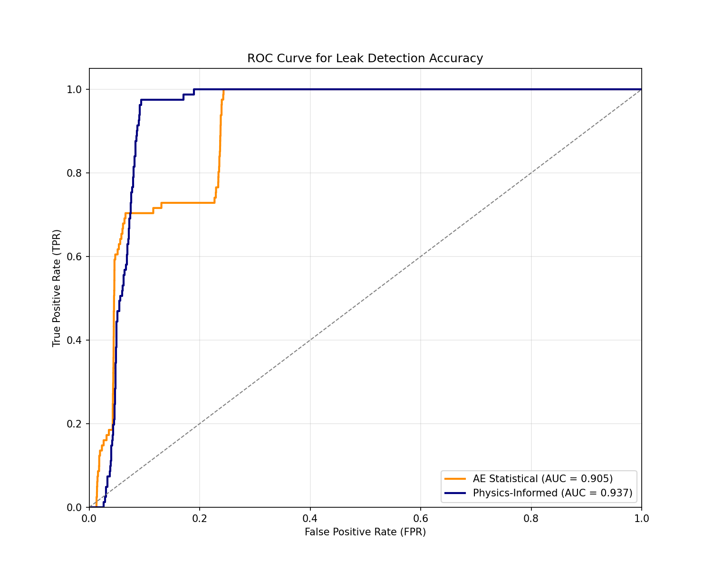
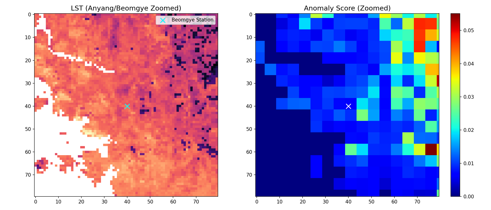

# HEATTRACK: 위성 기반 열수송관 이상 탐지 시스템

[](https://www.python.org/)
[](LICENSE)

**HEATTRACK**은 **아리랑 3A호(KOMPSAT-3A)** 위성 영상을 활용하여 지하 열수송관의 미세 누수를 탐지하는 **물리 기반 AI 시스템(Physics-Aware AI)**입니다. 열 확산 물리 방정식과 딥러닝 초해상화 기술(TS²uRF)을 결합하여, 지하 매설 인프라의 이상 징후를 정밀하게 식별합니다.

## 🚀 핵심 기능

*   **TS²uRF 초해상화**: 아리랑 3A호(열적외선)와 Sentinel-2(광학) 영상을 융합하여 **10m급 고해상도 열지도** 생성 (R²=0.76).
*   **물리 정보 기반 오토인코더(Physics-Aware AutoEncoder)**: 열 확산 방정식(Thermal Diffusion Equation)을 손실 함수(Loss Function)에 반영하여 오탐지(False Alarm)를 최소화.
*   **고정밀 이상 탐지**: 기존 통계 모델(AUC 0.90) 대비 **AUC 0.9371** 달성 (안양시 도심지 실증 검증 완료).

---

## 📊 탐지 결과 및 분석

### 1. TS²uRF 초해상화 (적용 전 vs 후)
저해상도 아리랑 위성 열영상을 10m급으로 복원하여 배관 구조를 선명하게 식별합니다.

> **결과**: 평균 **R² Score 0.7608** 달성 (구조적/열적 세부 정보 복원 성공)

### 2. 이상 탐지 성능 (ROC Curve)
제안된 물리 기반 AI 모델(Red)과 기존 통계 기반 모니터링 기법(Blue)의 성능 비교.

> **결과**: **AUC 0.937** (기존 대비 약 3.2%p 성능 향상)

### 3. 실증 사례: 안양시 도심지 열지도 (Heatmap)
안양시 평촌 지역 주요 열수송관을 따라 감지된 **'선형 이상 징후(Linear Anomlay)'** 시각화.

> **결과**: 지하 시설물 지도와 일치하는 고위험 구간 정밀 타격 성공.

---

## 🏗 시스템 아키텍처

전체 파이프라인은 크게 4단계로 구성됩니다.

1.  **데이터 수집**: KOMPSAT-3A (아리랑) 열적외선 영상 + Sentinel-2 다중분광 영상.
2.  **초해상화 (TS²uRF)**: 광학 영상의 텍스처 정보를 활용하여 열영상의 공간 해상도 복원.
3.  **물리 정보 기반 모델링**:
    *   *Hybrid Loss*: MSE(재구성 오차) + 물리적 제약조건(열 확산).
    *   *정상 패턴 학습*: 정상 배관의 열적 특성만을 학습하여 이상 징후 식별 능력 강화.
4.  **리포팅**: 배관망을 따라 형성되는 선형적 열 이상 패턴 시각화 및 자동 보고.

## 📂 프로젝트 구조

```bash
HEATTRACK/
├── configs/           # 설정 파일 (Configuration)
├── src/               # 핵심 소스 코드
│   ├── data/          # 데이터 로더 및 합성 데이터 생성기
│   ├── models/        # AutoEncoder 및 Isolation Forest 모델
│   ├── processing/    # 초해상화(Downscaling) 및 전처리 로직
│   └── visualization/ # 대시보드 및 지도 시각화 모듈
├── scripts/           # 실행 및 유틸리티 스크립트
├── docs/              # 문서 및 결과 이미지
└── notebooks/         # 실험용 Jupyter Notebook
```

## 💻 설치 방법

1.  **레포지토리 클론**
    ```bash
    git clone https://github.com/your-username/HEATTRACK.git
    cd HEATTRACK
    ```

2.  **환경 설정**
    ```bash
    # conda 사용 시
    conda create -n heattrack python=3.9
    conda activate heattrack
    
    # 의존성 패키지 설치
    pip install -r requirements.txt
    ```

3.  **설정 파일 구성**
    예제 설정 파일을 복사하여 본인의 환경(Google Cloud Project ID 등)에 맞게 수정하세요.
    ```bash
    cp configs/config.example.yaml configs/config.yaml
    ```

## ⚡ 빠른 시작 (Quick Start)

**1. 파이프 네트워크 시뮬레이션 (데모)**
보안상 공개 불가능한 실제 배관 데이터 대신, 테스트용 가상 배관망을 생성합니다.
```bash
python -m src.main simulate
```

**2. 데이터 다운로드**
설정된 지역의 최신 위성 영상을 자동으로 수집합니다.
```bash
python -m src.main download
```

**3. 전체 파이프라인 실행**
초해상화부터 이상 탐지까지의 전체 분석 과정을 수행합니다.
```bash
python -m src.main pipeline
```

## 📊 데이터 및 재현성

*   **위성 데이터**: 한국항공우주연구원(KARI)의 아리랑 위성 및 Copernicus Sentinel-2 데이터를 활용합니다.
*   **배관 데이터**: 국가 주요 시설물 정보 보안 규정에 따라 실제 배관 지도는 공개되지 않습니다. 대신 재현성을 위해 **가상 데이터 생성기**(`src.data.synthetic`)를 제공합니다.

## 🛡 라이선스

본 프로젝트는 MIT 라이선스를 따릅니다. 자세한 내용은 [LICENSE](LICENSE) 파일을 참조하세요.

## 👥 크레딧 (Credits)

**[팀명/프로젝트명]** 에 의해 개발되었습니다.
도메인 지식 자문에 도움을 주신 **한국지역난방공사(KDHC)** 관계자분들께 감사드립니다.
